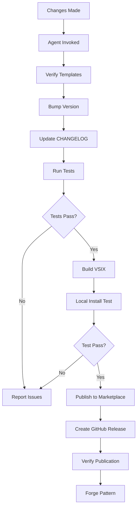

# ekkOS Extension Manager Agent

**Purpose**: Autonomous agent for managing the complete lifecycle of the ekkos-connect VS Code extension.

## Overview

The Extension Manager Agent handles:
- Template updates across all distribution files
- Version management and bumping
- VSIX building and packaging
- Pre-publish validation and testing
- Marketplace publishing
- Post-publish verification

## Agent Specification

### Name
`ekkos-extension-manager`

### Description
Manages the complete lifecycle of VS Code extension updates, from template changes to marketplace publication.

### Capabilities

#### 1. Template Management
- **Sync templates across platforms:**
  - `templates/CLAUDE.md` → User's `~/.claude/CLAUDE.md`
  - `templates/hooks/*` → User's `.claude/hooks/*`
  - `templates/skills/*` → User's `.claude/skills/*`
  - Windsurf/Cursor rule files

- **Validation:**
  - Ensure footer format is consistent
  - Check all template variables are documented
  - Verify hook compatibility (macOS/Linux/Windows)

#### 2. Version Management
- **Auto-bump version numbers:**
  - `package.json` version
  - `CHANGELOG.md` updates
  - Git tag creation
  - Version consistency checks

- **Version types:**
  - `patch`: Bug fixes, template updates (2.10.18 → 2.10.19)
  - `minor`: New features (2.10.19 → 2.11.0)
  - `major`: Breaking changes (2.11.0 → 3.0.0)

#### 3. Build & Package
- **VSIX creation:**
  ```bash
  npm run package
  # Creates: ekkos-connect-{version}.vsix
  ```

- **Pre-build checks:**
  - Run linter (`npm run lint`)
  - Compile TypeScript (`npm run compile`)
  - Verify all templates exist
  - Check for hardcoded credentials

- **Post-build verification:**
  - VSIX file size check
  - Extract and verify contents
  - Test installation locally

#### 4. Testing
- **Automated tests:**
  - Template validation
  - Hook script syntax check (bash -n)
  - MCP config JSON validation
  - Extension activation test

- **Manual test checklist:**
  - [ ] OAuth flow works
  - [ ] MCP config deploys correctly
  - [ ] Templates install to correct locations
  - [ ] Status bar shows connection status
  - [ ] All commands functional

#### 5. Publishing
- **Marketplace publication:**
  ```bash
  npx @vscode/vsce publish --pat $VSCE_PAT
  ```

- **Pre-publish checks:**
  - Verify publisher access (`vsce login`)
  - Check README.md is up-to-date
  - Ensure CHANGELOG.md has current version
  - Verify no sensitive data in package

- **Post-publish verification:**
  - Check marketplace listing
  - Verify download link works
  - Test auto-update notification

#### 6. Distribution
- **GitHub release:**
  - Create GitHub release with version tag
  - Attach VSIX file to release
  - Generate release notes from CHANGELOG

- **Notification:**
  - Update docs site
  - Post to Discord
  - Notify beta users

## Agent Tools

The agent has access to:
- **Bash**: For running npm scripts, git commands, testing
- **Read/Write/Edit**: For template and config file management
- **Glob/Grep**: For finding and validating files
- **WebFetch**: For checking marketplace status
- **ekkOS_Forge**: To save patterns about what worked/failed
- **ekkOS_Search**: To recall previous publishing issues

## Usage

### Invoke the agent

```typescript
Task({
  subagent_type: "ekkos-extension-manager",
  description: "Update templates and publish v2.10.19",
  prompt: `
    We fixed the footer format in templates/CLAUDE.md.
    Please:
    1. Verify the fix is in all template locations
    2. Bump version to 2.10.19 (patch)
    3. Update CHANGELOG.md
    4. Build VSIX
    5. Test locally
    6. Publish to marketplace
    7. Create GitHub release
  `
})
```

### Common Tasks

#### Task: Update Templates Only
```typescript
Task({
  subagent_type: "ekkos-extension-manager",
  description: "Sync template updates",
  prompt: "The footer format was updated in templates/CLAUDE.md. Verify it's consistent across all template files and update CHANGELOG."
})
```

#### Task: Publish Patch Release
```typescript
Task({
  subagent_type: "ekkos-extension-manager",
  description: "Publish patch release",
  prompt: "Publish version 2.10.19 with the template fixes. Run full pre-publish checks."
})
```

#### Task: Test Before Publishing
```typescript
Task({
  subagent_type: "ekkos-extension-manager",
  description: "Pre-publish validation",
  prompt: "We're ready to publish. Run all validation checks but don't publish yet."
})
```

## Agent Workflow

### Standard Release Flow



## Configuration

### Environment Variables
```bash
# Required for publishing
export VSCE_PAT="your-azure-devops-pat"
export GITHUB_TOKEN="your-github-token"

# Optional
export EKKOS_EXTENSION_AUTO_PUBLISH="true"
export EKKOS_EXTENSION_DRY_RUN="false"
```

### Agent Settings (in agent definition)
```json
{
  "name": "ekkos-extension-manager",
  "model": "sonnet",
  "tools": ["Bash", "Read", "Write", "Edit", "Glob", "Grep", "WebFetch", "ekkOS_Forge"],
  "auto_forge_patterns": true,
  "dry_run_default": false,
  "require_confirmation": {
    "publish": true,
    "version_bump": false,
    "template_changes": false
  }
}
```

## Error Handling

### Common Issues

| Issue | Detection | Resolution |
|-------|-----------|------------|
| PAT expired | `vsce publish` returns 401 | Guide user to regenerate PAT |
| Template syntax error | Hook validation fails | Show error line, suggest fix |
| Version conflict | Version already published | Suggest next version number |
| VSIX too large | File size > 50MB | Identify large files, suggest exclusion |
| MCP config invalid | JSON parse fails | Show JSON error, suggest fix |

### Pattern Forging

After each successful/failed operation, the agent should forge patterns:

```typescript
// Success pattern
ekkOS_Forge({
  title: "Publishing ekkos-connect v2.10.19 succeeded",
  problem: "Need to publish extension with template updates",
  solution: "Ran full validation checks, built VSIX, tested locally, published successfully",
  works_when: ["All tests pass", "VSIX builds clean", "Marketplace accepts version"]
})

// Failure pattern (anti-pattern)
ekkOS_Forge({
  title: "VSIX build failed due to TypeScript errors",
  problem: "npm run compile failed with type errors in extension.ts",
  solution: "Fixed type definitions, re-ran compile, build succeeded",
  anti_patterns: ["Skipping compile check before building VSIX"]
})
```

## Integration with Existing Workflow

### Current Process (Manual)
1. Developer makes changes
2. Developer manually updates templates
3. Developer manually bumps version
4. Developer runs `npm run package`
5. Developer tests locally
6. Developer runs `vsce publish`
7. Developer creates GitHub release

### With Agent (Automated)
1. Developer makes changes
2. Invokes: `ekkos-extension-manager "publish patch release"`
3. Agent handles steps 2-7 automatically
4. Agent reports results and forges patterns

## Next Steps

To implement this agent:

1. **Create agent definition** at `.claude/agents/ekkos-extension-manager/`
2. **Write system prompt** defining the agent's behavior
3. **Configure tool access** (which MCP tools can it use)
4. **Add validation scripts** in `extensions/ekkos-connect/scripts/`
5. **Test agent** with dry-run mode first
6. **Forge patterns** from successful runs

## Benefits

- ✅ **Consistency**: Templates always synced correctly
- ✅ **Speed**: Publish in minutes, not hours
- ✅ **Safety**: Automated pre-publish checks
- ✅ **Knowledge**: Patterns forged for future reference
- ✅ **Reliability**: No missed steps in release process
- ✅ **Audit trail**: Complete history of what was done

## Related Docs

- [Publishing Guide](../PUBLISHING_GUIDE.md)
- [Version Management](../VERSIONING.md)
- [Template System](../templates/README.md)
- [Testing Guide](../TESTING.md)

---

**Built for ekkOS™** - Making extension management autonomous
